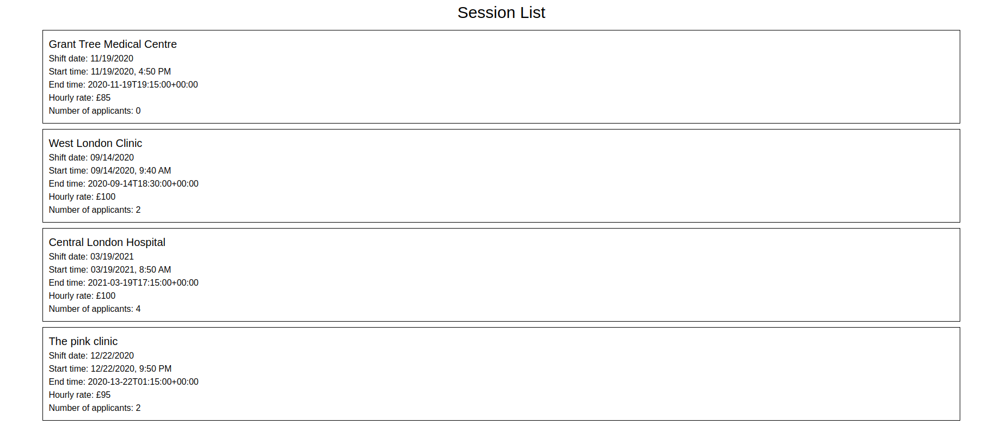

# Lantum tech test



This is my attempt at the Lantum tech test

## Getting started

```bash
# clone the repository to your local machine with either
# if you're using ssh
git clone git@github.com:PhilipVigus/lantum-test.git

# if you're using https
git clone git@github.com:PhilipVigus/lantum-test.git

# install project dependencies in the repository's root folder
yarn install

# start the project locally
yarn start
```

## Testing

```bash
# to run tests interactively
yarn test
```

## Improvements

### Formatting the end time

I had an issue with the endTimeDate's of some of the data passed back by the API. One or two of them had a month of 13, which meant that creating a Date object from the string threw an error. I didn't have time to investigate this further, so left the End time unformatted in the Session component.

### Adding global state

As commented in code, the user data is currently hard coded into the SessionsList component. This needs to be moved into global state, either using a React context or Redux. My preference would be the latter, as I find the syntax easier to work with.

Depending on any future additions to the project, it may also be necessary to move the sessions data currently stored locally in the SessionsList component into global state as well. This would be needed if a lot of other components required access to the same data, as the alternative would be to elevate it to a common parent component and use prop drilling, which can get messy very quickly.

### Responsive design

I would like to add some basic responsive design to the project. The most obvious addition would be to use media queries to reduce the size of the text a little at lower screen widths.

Depending on the future direction of the project, it might be necessary to do more complex changes. For example, if a nav bar is ever added with multiple elements, smaller screens might need this to collapse down to an expandable menu icon.

### Accessibility

The project currently only uses a couple of semantic html tags. This is unhelpful from an accessibility perspective, and I would like to do a pass over the code and add them where appropriate. An example addition would be using the time tag in the Session component. Another addition might be to use session or article tags for each session.

### Styling

The styling is obvious bare bones at the moment. I'd like to a little work to improve this, adding some colour, making the hierarchy of information clearer and generally smartening it up.
